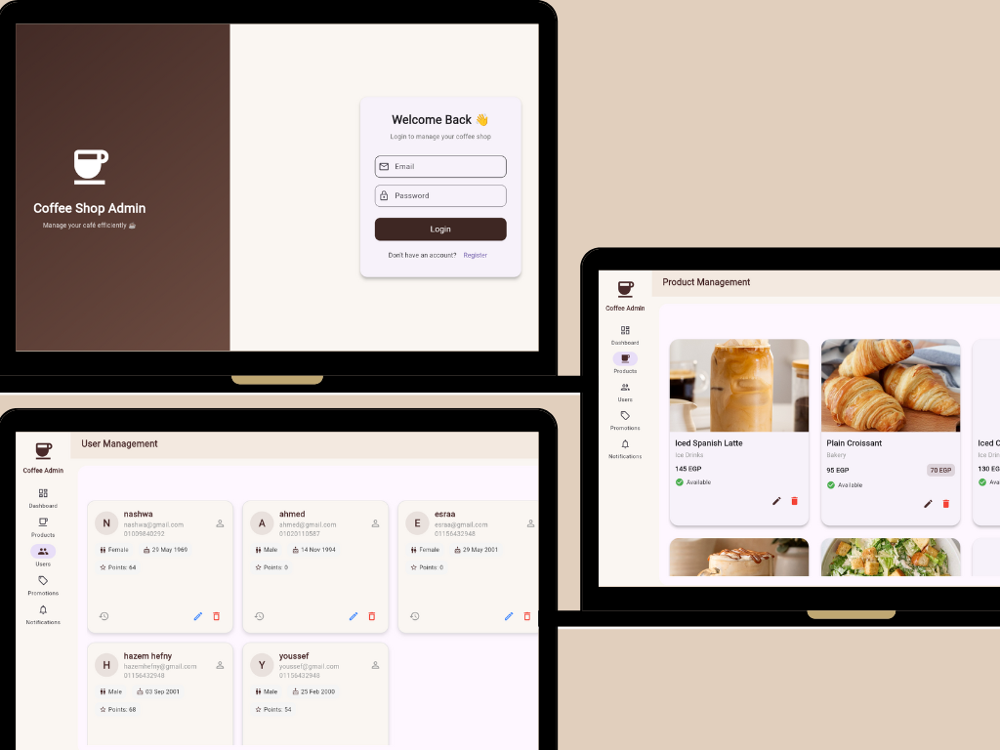
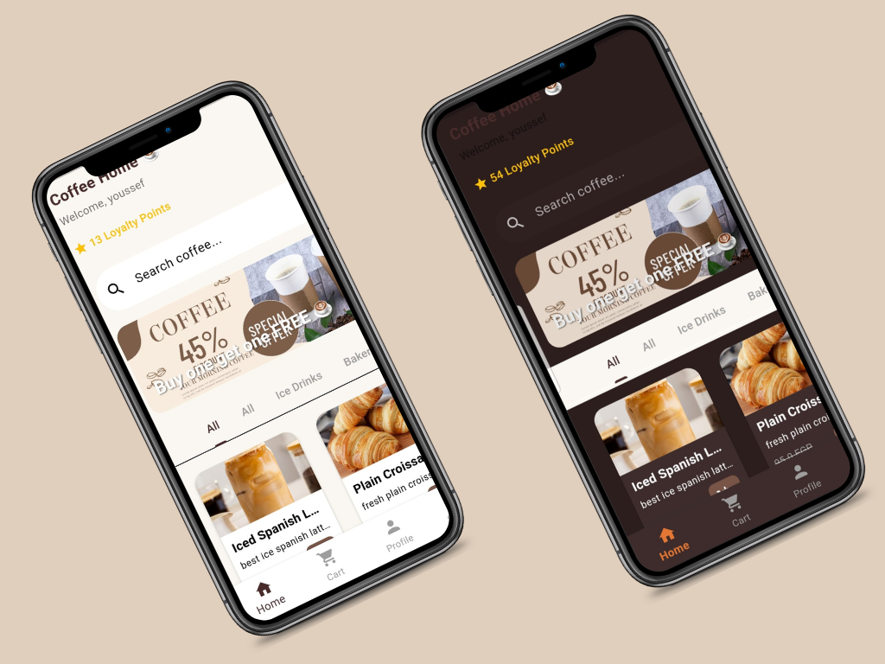
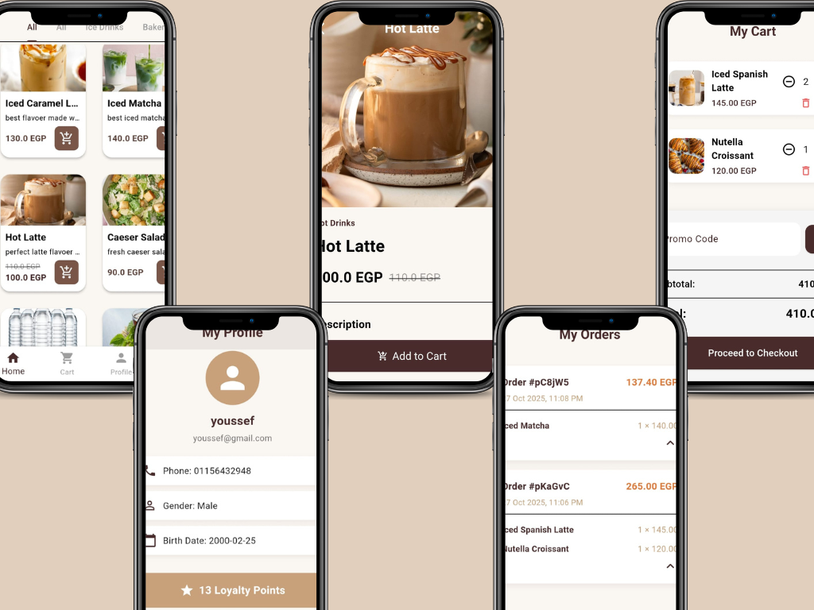

# ☕ Coffee Shop Full Ecosystem (Monorepo)


[](https://coffee-shop-admindashboard-d850bs5ri-hazems-projects-4b1773f2.vercel.app)

---

## 📖 Project Overview

A complete, production-ready coffee shop solution featuring a **Monorepo Architecture**. The system seamlessly integrates a **Customer Mobile App** (Android/iOS) with a powerful **Admin Web Dashboard**, sharing 100% of the business logic and models via a dedicated shared package.

---

## 📸 Visual Showcase

### 💻 Admin Dashboard (Web Control Panel)
*Manage products, track orders, and analyze sales with a responsive web interface.*

<div align="center">
  
  <p><em>Deployed on Vercel | Dark/Light Mode Supported</em></p>
</div>

<br>

### 📱 Customer Mobile App
*A smooth, native experience featuring a modern UI, Dark/Light themes, and real-time updates.*

| Light & Dark Mode | User Journey & Details |
|:---:|:---:|
|  |  |
| **Theme Management** | **Product, Cart & Profile** |

---

## 🚀 Key Features

### 📱 Customer App
- **Clean UI/UX:** Intuitive navigation for browsing menus and customizing orders.
- **Theme System:** Fully supported Dark & Light modes.
- **State Management:** Built with `Cubit` for predictable state changes.
- **Localization:** Ready for multi-language support.

### 💻 Admin Dashboard
- **Analytics:** Visual charts for sales, inventory, and user activity.
- **Management:** Full CRUD operations for Products, Users, and Offers.
- **Platform:** Optimized for Web (Chrome) and Tablets.
- **Clean URL:** Hosted on Vercel with production-grade performance.

### 🛠 Architecture & Tech Stack
- **Monorepo:** Organized into `mobile_app`, `admin_panel`, and `shared_module`.
- **Design Pattern:** Clean Architecture + MVVM.
- **Backend:** Firebase (Auth, Firestore, Storage).
- **Code Quality:** Strong typing, linting rules, and reusable widgets.

---

## 📂 Project Structure

```text
Coffee_Shop_Monorepo/
│
├── 📦 shared_module/      # The Core: Models, Constants, Styles (Used by both apps)
│
├── 📱 mobile_app/         # Flutter Mobile App (Consumer)
│   ├── lib/features/      # MVVM Modules (Home, Cart, Profile)
│   └── lib/core/          # Utils & Services
│
└── 💻 admin_panel/        # Flutter Web App (Admin)
    ├── lib/views/         # Dashboard Screens (Charts, Tables)
    └── web/               # Web specific configurations

---
Developed with ❤️ by **Hazem Hefny** using Flutter.